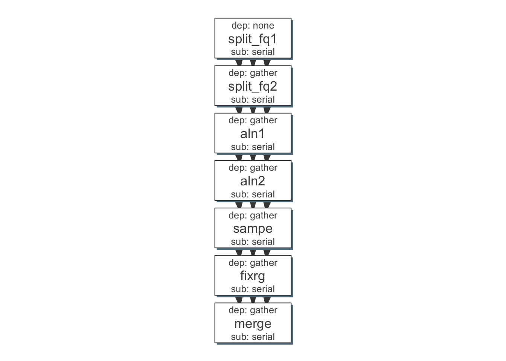
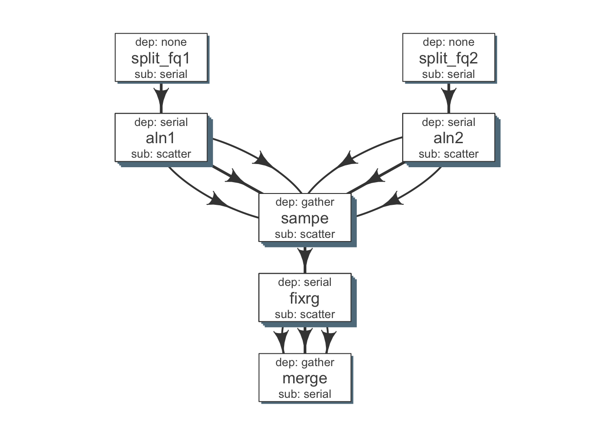

## Split the fastq files for faster processing
This can be handled within flowr.


```r
## Usually fastq gz has around 4 fold difference...
## 50 GB file becomes around 200 GB
#devtools::load_all("~/Dropbox/public/github_ngsflows")
#devtools::load_all("~/Dropbox/public/github_flow/")


require(flowr); require(ngsflows)
```

```
## Loading required package: flowr
## Loading required package: diagram
## Loading required package: shape
## Loading required package: whisker
## Flowr: streamlining workflows
## Loading required package: ngsflows
## Welcome to ngsflows !
```

```r
x = "/rsrch1/iacs/tmp/illumina_platinum/50x/NA12877/ERR194146_1.fastq.gz"
x = "/rsrch1/iacs/tmp/illumina_platinum/50x/NA12877/ERR194146_2.fastq.gz"
samplename = "ERR194146"

## load_conf() ## load a parameter file with all the configurations.

## to handle both reads, might need to handle the jobname
out_split1 = split_fq(x, samplename = samplename, chunks = 200, jobname = "split_fq1")
out_split2 = split_fq(x, samplename = samplename, chunks = 200, jobname = "split_fq2")


source("~/Dropbox/public/github_ngsflows/pipelines/aln_merge.R")
out_aln_merge = aln_bwa_merge(fqs1 = out_split1$outfiles,
  fqs2 = out_split1$outfiles,
  samplename = samplename)
```

```
## Generating a aln_bwa_merge flowmat for sample: ERR194146
```

```r
## --- stitch all the commands together!
flowmat = rbind(
  out_split1$flowmat,
  out_split2$flowmat,
  out_aln_merge$flowmat)

flowdef = to_flowdef(flowmat)
```

```
## input x is flowmat
## Creating a skeleton flow definition
## Following jobnames detected: split_fq1 split_fq2 aln1 aln2 sampe fixrg merge
```

```r
#write.table(flowdef, "ex_flow.def", row.names = FALSE, quote = FALSE, sep = "\t")

## --- create a flow object using this flow mat
#debug(to_flow)
fobj = to_flow(x = flowmat, def = flowdef, submit = FALSE)
```

```
## input x is flowmatdata.frame
## 
## 
## ##--- Getting default values for missing parameters...
## Using `samplename` as the grouping column
## Using `jobname` as the jobname column
## Using `cmd` as the cmd column
## Using flowname default: flowname
## Using flow_run_path default: ~/flowr/runs
## 
## 
## ##--- Checking flow definition and flow matrix for consistency...
## 
## 
## ##--- Detecting platform...
## Will use platform from flow definition
## 
## 
## ##--- flowr submission...
## 
## 
## Working on... ERR194146
## input x is list
## .......
```

```r
plot_flow(fobj)
```

```
## input x is flow
```



```r
## --- read a new flowdef
flowdef = as.flowdef("~/Dropbox/public/github_ngsflows/vignettes/ex_flow2.def")
```

```
## Def seems to be a file, reading it...
```

```r
fobj = to_flow(x = flowmat, def = flowdef)
```

```
## input x is flowmatdata.frame
## 
## 
## ##--- Getting default values for missing parameters...
## Using `samplename` as the grouping column
## Using `jobname` as the jobname column
## Using `cmd` as the cmd column
## Using flowname default: flowname
## Using flow_run_path default: ~/flowr/runs
## 
## 
## ##--- Checking flow definition and flow matrix for consistency...
## 
## 
## ##--- Detecting platform...
## 
## 
## ##--- flowr submission...
## 
## 
## Working on... ERR194146
## input x is list
## .......
```

```r
plot_flow(fobj)
```

```
## input x is flow
```



```r
#to_flow(out_aln_merge)
```

## Test if getting the fastq sheet works:


```
wd=/rsrch1/iacs/tmp/illumina_platinum/50x/NA12877/splt
cd $wd
flowr ngsflows:::create_fq_sheet x=$wd format="{{samplename}}_{{read}}_{{num}}.fastq.gz"
```
## Testing aln_merge

### Test step by step

Parse fastqs in a nice and clean format


```r
require(ngsflows)

wd='/rsrch1/iacs/tmp/illumina_platinum/50x/NA12877/splt'
out = create_fq_sheet(x=wd, format="{{samplename}}_{{read}}.{{num}}.fastq", ext = "fastq")
head(out);tail(out)

fq1 = subset(out, read == "1")$file[1] ## first of read one
fq2 = subset(out, read == "2")$file ## first of read one
```

## Let us call aln_merge on one of the samples

```r
source('pipelines/aln_merge.R')

flowmat = aln_bwa_merge(fqs1 = fq1, fqs2 = fq2, samplename = "ERR194146")
```


## MDA test

```r
wd = "/rsrch1/genetics/htep/hiseq/150707_ST-J00106_0022_AH35LGBBXX/Unaligned/YLD-NS-KO_RNA109";setwd(wd)
require(ngsflows)
out = create_fq_sheet(x=wd)
head(out);tail(out)
```

